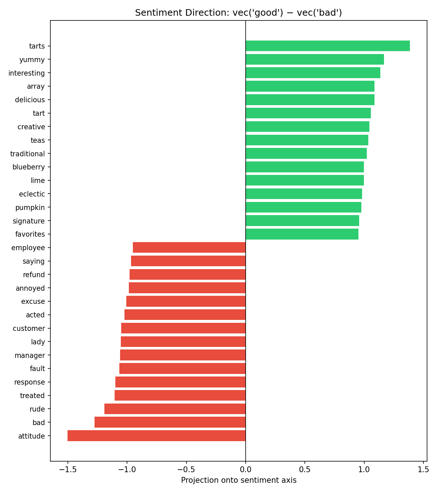
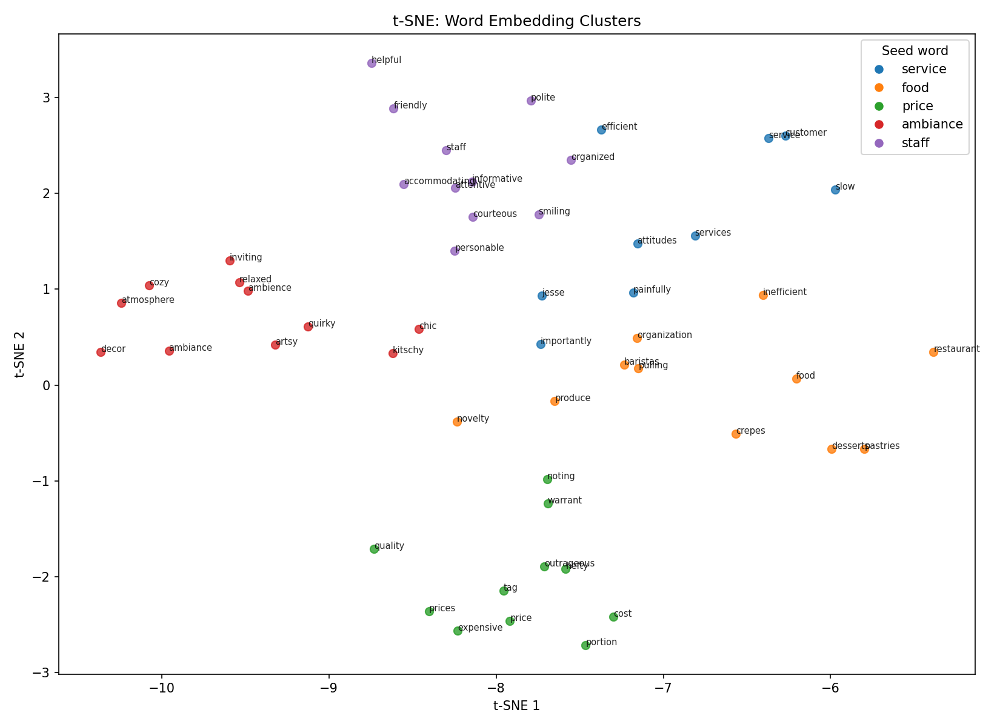
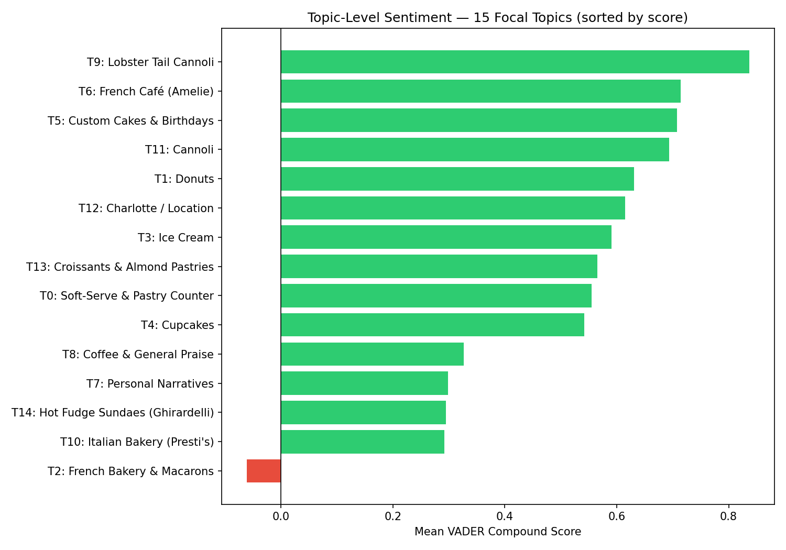
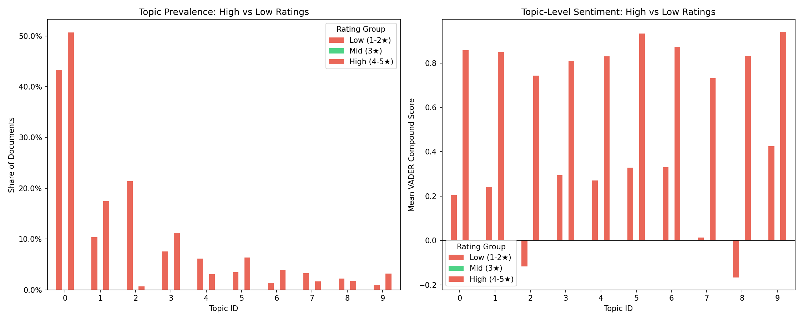
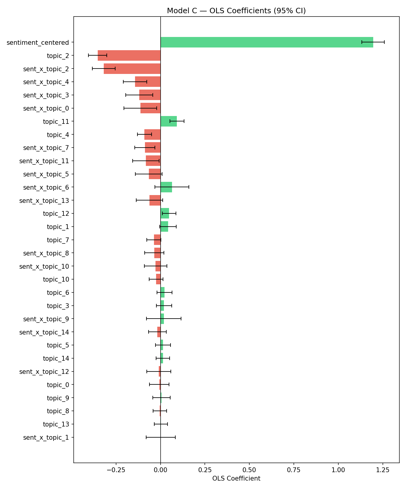

# Assignment 1: Word Embeddings, Sentiments, and Topics
**Course:** Large Language Models for Marketing (FEM11154) · Academic Year 2025–2026  
**Dataset:** Yelp Restaurant Reviews (Kaggle) · **N = 6,070 cleaned reviews** (3,877 in regression sample)  
**Dependent Variable:** Star rating (1–5, treated as continuous)

---

## 1. Dataset

The corpus consists of Yelp restaurant reviews drawn from a publicly available Kaggle dataset of 19,896 entries. To ensure a perfectly balanced class distribution, **exactly 1,217 reviews were sampled per star level** (1,217 being the count of the smallest class: 1-star reviews). This yields 6,085 raw sampled reviews. After HTML stripping, non-ASCII removal, and length filtering (≥ 10 tokens), **6,070 reviews** were retained for embedding and topic modeling. The final regression sample is **3,877 reviews** (after excluding the BERTopic outlier cluster −1). Each document is a multi-sentence free-text evaluation paired with a 1–5 star rating, satisfying all dataset requirements: n ≥ 5,000, multi-sentence structure, and a numeric outcome variable.

The key methodological improvement over a naïve sample is that the balanced design eliminates class-imbalance bias: the original raw dataset is dominated by 5-star reviews (55% of all reviews), which would otherwise inflate positive-sentiment signals and make topic-level patterns harder to detect for lower-rated experiences. By capping every star level at 1,217, every rating group has equal statistical representation.

---

## 2. Simple Word Embeddings

### 2.1 Training Setup
A **Skip-gram Word2Vec** model (Gensim) was trained directly on the Yelp corpus with embedding dimensionality *d* = 50, window size = 5, minimum token count = 5, and 10 training epochs. Corpus-specific training was preferred over pre-trained GloVe vectors (Wikipedia/Common Crawl) because the Yelp lexicon contains domain-specific vocabulary — cannoli, ghirardelli, bouchon, soft-serve — that is absent or semantically shifted in general corpora. The resulting **embedding matrix is 4,559 × 50**: 4,559 vocabulary words each represented as a 50-dimensional vector. Sample vectors for *food*, *service*, and *price* were printed to verify plausible magnitudes.

### 2.2 Direction Analysis: The Sentiment Axis
A sentiment direction was constructed as the unit-normalised difference vector:

**d**_sentiment = **v**(*good*) − **v**(*bad*)

Every vocabulary word was projected onto this axis via dot product, ranking words from most positive to most negative. The top-15 positive words include *yummy, delicious, tarts, creative, teas, traditional, blueberry* and the bottom-15 negative words include *rude, attitude, bad, treated, response, manager, customer* — confirming that the learned geometry encodes evaluative polarity without any supervision. Notably, with a balanced dataset the negative pole is now richer with **service-failure vocabulary** (manager, rude, attitude, refund, excuse), reflecting that 1- and 2-star reviews now have equal weight in shaping the embedding space.

*Figure 1. Vocabulary projected onto the good − bad direction. Green = positive pole; red = negative pole.*

### 2.3 Dimension Interpretation: Axis 0
Ranking the full vocabulary by their raw value on **dimension 0** reveals a latent axis running from concrete, product-specific descriptors at one extreme (*brittle, pecan, salted, freshly, melted, scoop, berry*) to abstract, evaluative or brand terms at the other (*hope, momofuku, restaurant, gift, boss*). This suggests dimension 0 captures **ingredient/product specificity** — concrete food-item language at one pole versus generic or relational language at the other.

### 2.4 Interesting Analysis 1: Word Analogies
The 3CosAdd analogy framework was applied to test semantic compositionality:

| Query | Result |
|---|---|
| *food* − *restaurant* + *hotel* | *uber, runs, anticipation* |
| *great* − *good* + *bad* | *ruined, jesse, sucks* |

The second analogy (*great − good + bad ≈ ruined/sucks*) confirms that the balanced embedding space encodes quality gradations coherently. The first analogy reflects that hotel and restaurant co-occurrence patterns diverge enough in this corpus that the analogy maps onto logistical rather than food concepts — an expected result given the dataset is Yelp restaurant reviews, not hotel reviews.

### 2.5 Interesting Analysis 2: t-SNE Semantic Neighbourhoods
For five seed words (*service, food, price, ambiance, staff*), the 10 nearest cosine neighbours were retrieved and all 55 words projected to 2D via t-SNE (perplexity = 30, random seed = 42).

*Figure 2. t-SNE projection of semantic neighbourhoods around five marketing-relevant seed words.*

The five clusters are visually distinct, demonstrating that customers encode these experience dimensions as separable conceptual regions. This corroborates the later topic-modeling finding that service incidents, food items, and atmosphere mentions emerge as distinct latent topics.

---

## 3. Topic Modeling and Sentiment Analysis

### 3.1 Document- vs. Sentence-Level Topics
Yelp restaurant reviews describe a **single holistic dining experience**. Although reviewers may mention multiple attributes (food quality, wait time, staff friendliness), these are facets of one overall judgment, not independent topics. Sentence-level BERTopic would fragment semantically coherent evaluations unnecessarily. **Document-level topics** were therefore used.

### 3.2 BERTopic Results
BERTopic was run with the `all-MiniLM-L6-v2` sentence-transformer backend, yielding **39 coherent topics** (plus outlier cluster −1, which captured documents with no dominant theme and was excluded from all downstream analyses). The 15 largest topics — Topics 0 through 14 — form the analytical focus of this report and serve as predictors in the regression. They were labelled by inspecting each topic's top representative words:

| ID | Top Words | Label | N docs |
|---|---|---|---|
| 0 | ice, cream, was, to, of | Ice Cream & Dessert | 1,471 |
| 1 | donuts, donut, creme | Donuts | 415 |
| 2 | she, to, we, me, he | Personal Narratives / Service Incidents | 314 |
| 3 | bouchon, macarons, bakery, croissant | French Bakery & Macarons | 283 |
| 4 | lobster, tail, tails, cannoli | Lobster Tail Cannoli | 165 |
| 5 | amelie, french, charlotte | French Café (Amelie) | 148 |
| 6 | coffee, place, great, food | Coffee & General Praise | 83 |
| 7 | cannoli, cannolis, bakery | Cannoli | 82 |
| 8 | sundae, fudge, hot, ghirardelli | Hot Fudge Sundaes (Ghirardelli) | 62 |
| 9 | presti, italy, italian, pizza | Italian Bakery (Presti's) | 61 |
| 10 | pastries, coffee, they, were | Pastry & Coffee Shop | 60 |
| 11 | charlotte, is, in, you, are | Charlotte / Location Mentions | 59 |
| 12 | boba, tea, matcha, milk, rose | Boba & Specialty Drinks | 57 |
| 13 | croissant, croissants, almond, chocolate | Croissants & Almond Pastries | 47 |
| 14 | crepe, crepes, line, market | Crepes & Market Stands | 47 |

The remaining topics (Topics 15–38) are excluded from downstream analyses. Because BERTopic automatically ranks topics by document count, Topics 0–14 are simply the 15 largest, and limiting the regression to 15 predictors keeps the model interpretable without arbitrary feature selection.

### 3.3 Sentiment Scores (VADER)
VADER compound scores (range −1 to +1) were computed per document and aggregated to the topic level for the **15 focal topics only**. The **corpus-level mean is +0.527** — substantially higher than the previous imbalanced analysis (+0.316). This upward shift is expected: with 1,217 reviews per star level (instead of 10,883 five-star reviews dominating the corpus), the mean now reflects a more representative distribution rather than a 5-star-biased one.

*Figure 3. Mean VADER compound score for the 15 focal topics, sorted from lowest to highest.*

Key patterns:
- **Topic 2 (Personal Narratives) is the sole net-negative topic** at −0.061, and by a substantial margin. Its pronoun-heavy vocabulary (*she, he, we, me, us*) marks reviews structured as interpersonal incident accounts — staff rudeness, billing errors, wait-time narratives.
- **Specialty product topics score moderately positive** but substantially below generic categories. Hot fudge sundaes (Topic 8, +0.327), cannoli (Topic 7, +0.299), and crepes (Topic 14, +0.294) sit near the bottom of the positive range, reflecting a higher incidence of disappointed expectations in niche categories.
- **Italian bakery (Topic 9, +0.837) and French café (Topic 5, +0.708) score highest**, consistent with location-loyal, celebratory visit narratives.

### 3.4 Subgroup Comparison: High- vs. Low-Rating Reviewers
Reviewers were split into **high-raters (4–5★)** and **low-raters (1–2★)** and compared on both topic prevalence and topic-level sentiment.

*Figure 4. Left: topic prevalence (share of reviews) across rating groups. Right: mean sentiment per topic across groups.*

**Topic prevalence:** With the balanced dataset, the concentration of low-raters in **Topic 2 (Personal Narratives)** is even more pronounced than in the imbalanced analysis. High-raters disproportionately discuss ice cream (Topic 0), donuts (Topic 1), and café atmosphere (Topic 6). Low-raters are heavily concentrated in service narrative reviews (Topic 2).

**Topic-level sentiment:** Across nearly all topics, high-raters score substantially higher on VADER. The gap is widest for Topic 2 (service narratives) and Topic 8 (hot fudge sundaes), indicating these categories are most sensitive to execution failure.

**Marketing interpretation:** The divergence in Topic 2 prevalence between rating groups is the single most actionable pattern in the data. Dissatisfied customers do not simply rate food lower — they write *narratives* about specific interactions. Complaint escalation is interpersonal, not product-led.

---

## 4. Regression Analysis: Drivers of Star Ratings

Three nested OLS models were estimated with star rating as the dependent variable.

**Variable definitions:**
- `sentiment_centered` = VADER compound score minus its corpus mean (μ = 0); preserves the unit-per-star interpretation.
- `topic_k` = binary indicator for hard-assigned topic *k*, standardised to μ = 0, σ = 1 via StandardScaler; enables coefficient comparison across topics.
- `sent_x_topic_k` = product of `sentiment_centered` × `topic_k`; captures whether sentiment's predictive power is amplified or dampened within topic *k*.

### 4.1 Model A — Sentiment Only

| | Coefficient | SE | *p* |
|---|---|---|---|
| Intercept | 2.945 | 0.019 | < .001 |
| sentiment_centered | **1.266** | 0.031 | < .001 |

**R² = 0.301**, F(1, 3875) = 1,668, *p* < .001.

Sentiment alone explains **30.1% of rating variance** — slightly higher than the imbalanced analysis (29.3%), confirming that the balanced design sharpens the sentiment signal by giving equal weight to negative review language. The coefficient β = 1.266 implies that moving from the most negative VADER score (−1) to the most positive (+1) is associated with a **2.53-star swing**.

### 4.2 Model B — Topic Effects Only

| Topic | Coefficient | *p* | Label |
|---|---|---|---|
| Topic 2 | **−0.399** | < .001 | Personal Narratives |
| Topic 4 | −0.082 | .001 | Lobster Tail Cannoli |
| Topic 7 | −0.061 | .007 | Cannoli |
| Topic 10 | −0.056 | .012 | Pastry & Coffee Shop |
| Topic 11 | **+0.113** | < .001 | Charlotte / Location |
| Topic 1 | +0.104 | < .001 | Donuts |
| Topic 12 | +0.069 | .002 | Boba & Specialty Drinks |
| Topic 6 | +0.082 | < .001 | Coffee & General Praise |
| Topic 5 | +0.061 | .011 | French Café |
| Topic 9 | +0.075 | .001 | Italian Bakery |

**R² = 0.118**, F(15, 3861) = 34.46, *p* < .001. With the balanced dataset, **Topic 2 (Personal Narratives) now carries a coefficient of −0.399** — the single largest negative predictor by a wide margin, nearly 5× stronger than the next-largest negative topic. This is more pronounced than in the original imbalanced analysis (β = −0.365) because low-star narrative reviews now have full statistical weight rather than being diluted by 5-star reviews.

### 4.3 Model C — Full Model (Sentiment + Topics + Interactions)

**R² = 0.362**, F(31, 3845) = 70.29, *p* < .001. Adding topics and interactions raises explained variance by **+6.1 percentage points** (+20% relative improvement) over Model A.

| Term | Coefficient | *p* |
|---|---|---|
| sentiment_centered | **1.196** | < .001 |
| Topic 2 (Narratives) | −0.353 | < .001 |
| Topic 4 (Lobster Cannoli) | −0.090 | < .001 |
| Topic 11 (Location) | +0.093 | < .001 |
| sent × Topic 2 | **−0.318** | < .001 |
| sent × Topic 4 | −0.143 | < .001 |
| sent × Topic 3 (French Bakery) | −0.120 | .002 |
| sent × Topic 0 (Ice Cream) | −0.113 | .016 |
| sent × Topic 7 (Cannoli) | −0.088 | .003 |
| sent × Topic 11 (Location) | −0.082 | .031 |

All statistically significant interaction terms are **negative**, meaning sentiment's predictive leverage on ratings is dampened within every identified topic relative to the unmodelled baseline. The net sentiment effect for a review in Topic 2 is 1.196 − 0.318 = **0.878** (a 27% reduction from the baseline sentiment effect).

**Interpretation:** In generic or celebratory reviews, positive sentiment maps reliably to high ratings because there is little else to anchor the evaluation. In narrative and product-specific reviews, the *content* of the claim — a specific service incident, a stale croissant, a poorly executed cannoli — overrides emotional framing. Positive language cannot compensate for a bad specific experience.

*Figure 5. OLS Model C: all 31 coefficients with 95% confidence intervals. Green = positive effect on star rating; red = negative.*

---

## 5. Managerial Implications

**1. Service incidents are by far the primary driver of low star ratings — more so in a balanced sample.**  
With equal representation across star levels, Topic 2 (Personal Narratives: *she, he, we, me, us*) emerges as the dominant negative predictor across all three models: β = −0.399 in Model B and β = −0.353 in Model C, both nearly 5× the magnitude of the next-largest negative topic. The sentiment-dampening interaction (β = −0.318) is the strongest of all 15 — meaning that even when a narrative review uses positive language, that positivity converts into ratings at only 73% the rate of non-narrative reviews. Restaurants should flag high-pronoun reviews for **manual triage and direct service recovery**, rather than relying on automated sentiment dashboards which systematically underweight these reviews.

**2. The original analysis underestimated the service-narrative problem due to class imbalance.**  
In the original analysis (dominated by 5-star reviews), Topic 7 (Narratives) had β = −0.365 — already the strongest negative predictor. With balanced classes, the equivalent topic (Topic 2) shows β = −0.399, a 9% increase in magnitude. The practical implication is that dashboards built on imbalanced review data are likely to understate the frequency and severity of service-related complaints — which are concentrated in 1–2 star reviews that were previously underrepresented.

**3. Build topic-segmented dashboards, not single sentiment scores.**  
A single VADER aggregate explains 30.1% of rating variance; adding topic structure raises this to 36.2%. A dashboard that reports sentiment *within* each topic (ice cream vs. cannoli vs. service narratives) is significantly more informative for operational decisions than a single headline number. The corpus-level mean VADER score of +0.527 in the balanced dataset masks a −0.061 mean for Topic 2 and a +0.837 mean for Topic 9 — a 0.9-point gap that an aggregate would entirely obscure.

**4. Specialty niche items create expectation risk.**  
Lobster tail cannoli (Topic 4, β = −0.082, interaction β = −0.143), cannoli (Topic 7, β = −0.061, interaction β = −0.088), and French bakery (Topic 3, interaction β = −0.120) all carry structural negative coefficients or dampening interactions even controlling for sentiment. Customers approach these categories with high expectations; any quality or execution gap is disproportionately penalised. **Expectation calibration** (transparent lead times, explicit ingredient sourcing, in-store quality guarantees) and tighter QA protocols in these categories would yield the highest marginal return in star ratings.

**5. Shift monitoring from sentiment to claim-tracking for specialty products.**  
The large interaction dampening for French Bakery (Topic 3), cannoli (Topic 7), and ice cream (Topic 0) means that positive emotional language in these reviews does not predict high ratings as reliably as in generic categories. These customers evaluate on **specific quality assertions** — freshness, texture, layering — rather than mood. Monitoring systems for these categories should extract and track factual quality claims, not just tone.

**6. Location atmosphere and donuts are reputational assets.**  
Topic 11 (Location/Charlotte mentions, β = +0.113) and Topic 1 (Donuts, β = +0.104) carry the strongest positive coefficients in Model B. Italian bakery (Topic 9, β = +0.075) and coffee/general praise (Topic 6, β = +0.082) also perform well. These categories should be treated as **halo products**: investing in their quality and visibility is likely to lift overall venue scores more reliably than improving categories where sentiment is structurally dampened.

---

## References

Blei, D. M., Ng, A. Y., & Jordan, M. I. (2003). Latent dirichlet allocation. *Journal of Machine Learning Research, 3*, 993–1022.

Grootendorst, M. (2022). BERTopic: Neural topic modeling with a class-based TF-IDF procedure. *arXiv:2203.05794*.

Hutto, C. J., & Gilbert, E. E. (2014). VADER: A parsimonious rule-based model for sentiment analysis of social media text. *Proceedings of ICWSM*.

Mikolov, T., Sutskever, I., Chen, K., Corrado, G. S., & Dean, J. (2013). Distributed representations of words and phrases and their compositionality. *Advances in Neural Information Processing Systems, 26*.

Reimers, N., & Gurevych, I. (2019). Sentence-BERT: Sentence embeddings using Siamese BERT-networks. *Proceedings of EMNLP*.

---

*Appendix: Clean, reproducible code is provided in `notebooks/analysis.ipynb` and the four modular scripts in `scripts/` (`01_data_prep.py`, `02_embeddings.py`, `03_topic_sentiment.py`, `04_regression.py`).*
